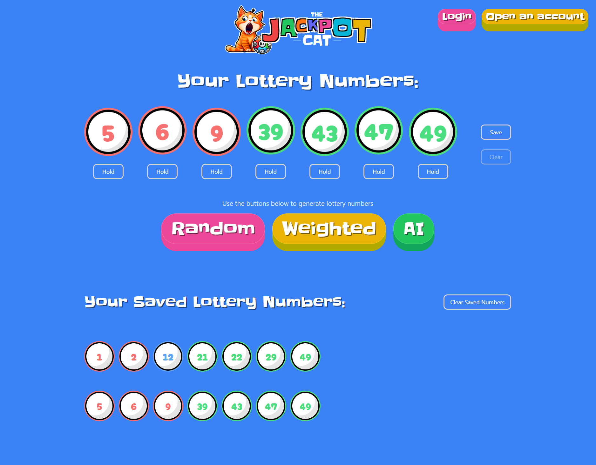

# Jackpot Cat Backend

## Overview

Jackpot Cat is a backend project built with Node.js and Express.js, designed to generate lottery number predictions. The backend offers two main prediction modes: one that generates weighted lottery numbers and another that utilizes a Keras model trained on historical data for predictions. The project also includes a Prisma ORM integration with MySQL for database management and Python scripts for data scraping and AI predictions.

## Screenshot

## Core Technologies

- **Node.js**: JavaScript runtime environment
- **Express.js**: Web framework for Node.js
- **TypeScript**: Typed superset of JavaScript
- **Prisma**: ORM for database management
- **MySQL**: Relational database management system
- **Python**: Used for scraping and running AI predictions (using PythonShell)
- **Keras**: Deep learning library in Python
- **JWT**: For token-based authentication

## Features

- **JWT Authentication**: Middleware to protect routes
- **Weighted Lottery Number Generation**: Generates numbers based on historical frequency
- **AI-Based Lottery Number Prediction**: Utilizes a neural network to predict numbers
- **Data Scraping**: Python scrapers for historical and latest lottery results
- **Scheduled Tasks**: Cron jobs to update lottery results

## File Structure

- **src/**: Main source code directory
   - **routes/**: API route handlers
   - **controllers/**: Controller logic for routes
   - **middlewares/**: Middleware for authentication
   - **services/**: Prisma client and other services
   - **cron/**: Cron jobs and scheduler scripts
   - **ai/**: Python scripts for AI predictions

